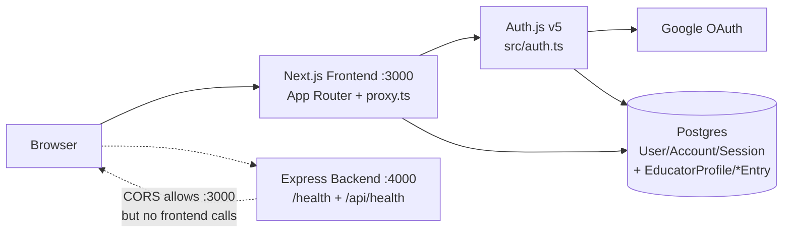
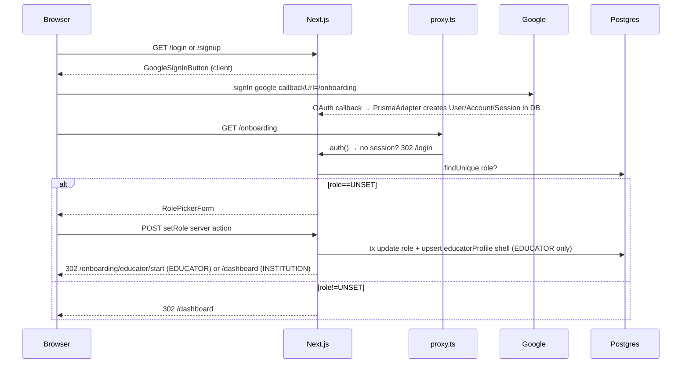
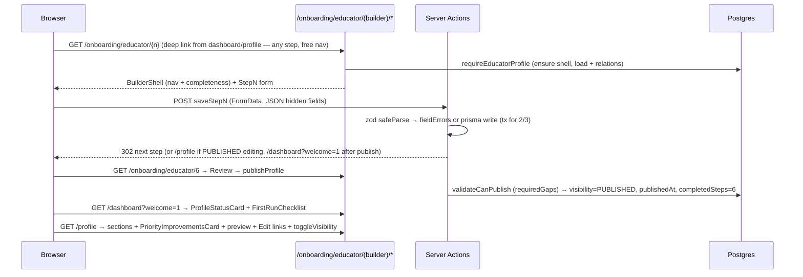

# EduMatch — Project Status & Architecture

> Generated: 2026-09-30
> Branch: `main` — dirty tree (uncommitted educator-profile work)
> Commits on HEAD (7): `Initial commit` → `ci + /health` → `theme switch` → `landing edits` → `Google OAuth` → `theme toggle` → `fix: sync package lock`
> Uncommitted vs HEAD: all educator-vertical work plus the **Minimal Onboarding UX revamp** (new `/onboarding/educator/start` screen, wizard moved to route group `(builder)` with free navigation, dashboard/profile pressure-free copy + `PriorityImprovementsCard`, Vitest unit suite + Playwright E2E, CI unit-test step). This doc itself (`PROJECT_STATUS.md`, repo root) is untracked.
> Scope of this doc: everything currently in `frontend/` + `backend/` + `prisma/` + CI, **including uncommitted work**.

## 1. One-line summary

EduMatch is a two-app monorepo for Indian higher-ed hiring: a **Next.js 16 frontend** (landing site + Google auth + role onboarding → **minimal educator setup screen** + **6-step profile wizard (free-nav profile editor) + `/profile` + role-aware dashboard**) backed by **Postgres + Prisma + Auth.js v5**, plus a minimal **Express backend** that still only serves health checks and is **not yet wired to the frontend**.

Product stage: **pre-launch / foundation + first domain vertical**. Marketing UI, auth, role plumbing, and the **educator profile vertical (draft → publish → edit, completeness scoring, heuristic match estimate)** work. Institution profiles, listings, applications, real matching, and resume upload do not exist yet — landing-page "matching" is still a client-side demo and the wizard's `MatchEstimate` is a demand-table heuristic.

---

## 2. Tech stack

### Frontend — `frontend/package.json`
| Layer | Choice / Version |
|---|---|
| Framework | `next@16.3.5` (App Router, Turbopack, `proxy.ts` middleware convention) |
| UI | `react@19.2.8`, `react-dom@19.2.8` |
| Auth | `next-auth@5.0.0-beta.32` (Auth.js v5) + `@auth/prisma-adapter@2.11.3` |
| DB client | `@prisma/client@6.19.3` / `prisma@6.19.3` (CLI) |
| DB | PostgreSQL (`provider = "postgresql"` in `frontend/prisma/schema.prisma:5-8`) |
| Validation | `zod@4.6.5` — **new since last doc** (wizard schemas in `lib/educator/schema.ts`) |
| Server boundary | `server-only@0.0.1` — **new** (enforced in `lib/educator/profile.ts:1`) |
| Styling | `tailwindcss@4` + `@tailwindcss/postcss@4`, custom `@theme` tokens in `frontend/src/app/globals.css` |
| Icons | `lucide-react@1.45.0` |
| Fonts | `next/font/google`: `Plus_Jakarta_Sans` + `Newsreader` in `frontend/src/app/layout.tsx` |
| Images | `next/image`, remote `lh3.googleusercontent.com` allowed in `frontend/next.config.ts` |
| Language | `typescript@5`, `eslint@9` + `eslint-config-next` |
| Tests | `vitest@5` (unit, `src/lib/educator/__tests__/`, `npm test`) + `@playwright/test` (E2E, `e2e/`, `npm run test:e2e`) — **new** |

### Backend — `backend/package.json`
Unchanged since last doc.
| Layer | Choice / Version |
|---|---|
| Runtime | `node >=20` |
| Server | `express@5.2.1`, `cors@2.8.6`, `dotenv@17.4.2` |
| Dev / Build | `tsx@4.23.13` (`dev: tsx watch src/index.ts`), `typescript@7.0.2` (`build: tsc`, `lint: tsc --noEmit`) |
| Module | ESM (`"type": "module"`), `NodeNext` resolution in `backend/tsconfig.json` |

### Infra / DX
- CI: `.github/workflows/ci.yml` — unchanged. Parallel `frontend` (install → prisma generate → lint → `tsc --noEmit` → build) and `backend` (install → `tsc --noEmit` → build) on Node 22.
- Env examples: `frontend/.env.example`, `backend/.env.example` (never commit `.env.local`).
- No tests, no Dockerfile, no deployment config yet.

---

## 3. Repo map (source files only, excl. `node_modules/.next/dist`)

```
EduMatch/
  PROJECT_STATUS.md               # this file (untracked, root)
  .github/workflows/ci.yml        # unchanged
  backend/                        # unchanged
    src/app.ts                    # CORS + JSON + /health + /api/health + 404
    src/index.ts                  # listen(PORT)
    src/config/env.ts             # PORT, FRONTEND_URL, NODE_ENV with fallbacks
    src/routes/health.ts          # GET / -> {status, service, timestamp}
  frontend/
    prisma/
      schema.prisma               # MODIFIED: + EducatorProfile/EducationEntry/ExperienceEntry + 8 enums
      migrations/20260914134651_init/migration.sql            # committed (User/Account/Session)
      migrations/20260916120000_educator_profile/migration.sql # NEW, untracked
    src/
      auth.ts                     # unchanged (Google + PrismaAdapter, DB sessions)
      proxy.ts                    # MODIFIED: matcher + /onboarding/:path* + /profile/:path*
      lib/prisma.ts               # unchanged singleton
      lib/site.ts                 # unchanged SITE constants
      lib/theme.ts                # unchanged theme store
      lib/educator/               # NEW, untracked (all wizard domain logic)
        schema.ts                 # zod schemas step1-5 + minimalOnboardingSchema + formDataToObject
        profile.ts                # server-only ensure/get/requireEducatorProfile/requireEducatorWithUser
        completeness.ts           # computeCompleteness (100-pt, MissingItem.why) + requiredGaps/validateCanPublish
        constants.ts              # STEPS, label maps, INDIAN_STATES
        match-estimate.ts         # estimateMatches heuristic
        __tests__/                # NEW: Vitest unit suite (completeness/schema/match-estimate/publish-locks)
      types/next-auth.d.ts        # unchanged Session.user {id, role}
      app/
        layout.tsx / page.tsx / globals.css / manifest.ts / robots.ts / sitemap.ts / icon.svg / opengraph-image.tsx / not-found.tsx  # unchanged
        login/page.tsx / signup/page.tsx   # unchanged, Google-only
        onboarding/page.tsx       # MODIFIED: role-branch redirects
        onboarding/actions.ts     # MODIFIED: tx + educator upsert + branch redirect
        onboarding/educator/      # NEW, untracked
          start/page.tsx          # NEW minimal screen (force-dynamic, no builder chrome)
          (builder)/page.tsx      # resume router (completedSteps 0 → /dashboard; else next step)
          (builder)/layout.tsx    # BuilderShell + completeness
          (builder)/[step]/page.tsx # switch 1-6, free navigation (force-dynamic)
          actions.ts              # saveStep1-5, skipStep4, publishProfile, completeMinimalOnboarding
        dev/                      # NEW: dev-only skip-login action (delete before launch)
        dashboard/page.tsx        # MODIFIED: educator ProfileStatusCard + FirstRunChecklist
        dashboard/actions.ts      # unchanged signOutAction
        profile/                  # NEW, untracked
          page.tsx                # read-only profile + per-section Edit + visibility toggle (force-dynamic)
          actions.ts              # toggleVisibility
        privacy/page.tsx / terms/page.tsx  # unchanged drafts
      components/
        Logo.tsx / ThemeToggle.tsx / GoogleSignInButton.tsx / LegalPage.tsx  # unchanged
        landing/Navbar.tsx, Hero.tsx, Marquee.tsx, ForEducators.tsx,
                ForInstitutions.tsx, WhoItsFor.tsx, HowItWorks.tsx,
                ComparisonTable.tsx, MatchSimulator.tsx, Faq.tsx, Join.tsx, Footer.tsx,
                ProfileCard.tsx   # unchanged
        onboarding/RolePickerForm.tsx  # CTA copy → "Continue"
        onboarding/MinimalOnboardingForm.tsx  # NEW: discipline + employment types + sessionStorage draft
        educator/                 # NEW, untracked
          BuilderShell.tsx / StepProgress.tsx / ProfileStatusCard.tsx / VisibilityCard.tsx
          FirstRunChecklist.tsx / MatchEstimate.tsx / PriorityImprovementsCard.tsx / EducatorProfilePreview.tsx
          FormField.tsx / FieldError.tsx / SubmitButton.tsx / ErrorSummary.tsx / ValidatedForm.tsx
          TagInput.tsx / RepeatableList.tsx / EducationRow.tsx / ExperienceRow.tsx
          SearchableSelect.tsx / SelectionCard.tsx / StickyStepActions.tsx / OptionalBadge.tsx / PreviewRail.tsx
          steps/Step1Basics.tsx … Step6Review.tsx
        3d/MatchRing.tsx, NetworkCanvas3D.tsx, usePrefersReducedMotion.ts  # unchanged (MatchRing now reused by wizard/dashboard/profile)
```

---

## 4. What works today (functionality inventory)

### 4.1 Landing site — `/` (`frontend/src/app/page.tsx`)
Unchanged. Fully static + interactive demo, no backend calls: Navbar / Hero (persona switch) / Marquee / ForEducators / ForInstitutions / WhoItsFor+HowItWorks / ComparisonTable / **MatchSimulator (still fake: `Discipline` + `Level` → `CRITERIA_BASE` + `LEVEL_ADJUST` → avg score, "Demo only")** / FAQ+Join+Footer / 3D (`MatchRing` SVG ring now also reused by wizard, dashboard, profile).

### 4.2 Theming — dark/light with circular reveal
Unchanged (`lib/theme.ts`, `ThemeToggle.tsx`, anti-FOUC script in `layout.tsx`, `.dark` tokens in `globals.css`).

### 4.3 Auth (Google OAuth 2.0 only)
Unchanged (`src/auth.ts`, `types/next-auth.d.ts`, `GoogleSignInButton.tsx`, `login/`+`signup/`, `dashboard/actions.ts` sign-out).

### 4.4 Onboarding (role gate) — MODIFIED
- `app/onboarding/actions.ts:14-18` — `setRole` is a **`prisma.$transaction`**: `user.update({role})` + if `EDUCATOR`, `educatorProfile.upsert({where:{userId}, create:{userId}, update:{}})` (idempotent shell row). Redirect branches: `EDUCATOR → /onboarding/educator/start`, `INSTITUTION → /dashboard` (was always `/dashboard`).
- `app/onboarding/page.tsx:22-23` — page guard: `role !== UNSET → /dashboard` (previously `EDUCATOR → /onboarding/educator`); `UNSET` still renders `<RolePickerForm/>`. RolePicker CTA copy is now "Continue".
- `src/proxy.ts:19` — matcher widened from `["/dashboard/:path*", "/onboarding"]` to **`["/dashboard/:path*", "/onboarding/:path*", "/profile/:path*"]`**. Nuance: the `isProtected` check (`proxy.ts:7-10`) still only tests `pathname.startsWith("/dashboard") || startsWith("/onboarding")` — so `/profile/*` runs through middleware but is **not** auth-redirected at the edge; protection there is page-level (`auth()` + role check in `app/profile/page.tsx:66-72`).

### 4.5 Educator onboarding — minimal screen + wizard — NEW (all untracked)
**Flow**: role pick → **`/onboarding/educator/start`** (2 questions or explicit "Skip for now") → `/dashboard?welcome=1`. The 6-step wizard now lives in route group **`app/onboarding/educator/(builder)/`** and is a pure profile editor (deep links from dashboard/profile), with **free navigation** (skip-ahead guard removed). Steps defined in `lib/educator/constants.ts:1-8` (`basics, academics, experience, research[optional], preferences, review`).

| Piece | File | Behaviour |
|---|---|---|
| Minimal start screen | `app/onboarding/educator/start/page.tsx` (`force-dynamic`) | `requireEducatorProfile()`; `PUBLISHED → /dashboard`; renders card + `MinimalOnboardingForm` (no `BuilderShell` chrome — lives outside the `(builder)` group) |
| Minimal action | `completeMinimalOnboarding` in `app/onboarding/educator/actions.ts` | `intent=skip` → redirect with **no write**; otherwise `minimalOnboardingSchema` (discipline required, employmentTypes optional, checkboxBool handles `"false"` string) validated **before** any write → `educatorProfile.update` → `redirect("/dashboard?welcome=1")` |
| Minimal form | `components/onboarding/MinimalOnboardingForm.tsx` (client) | Edits mirrored to sessionStorage `edumatch.minimalOnboarding.v1` (`{t, discipline, employmentTypes}`) so browser Back never empties the form; on mount re-applies draft only when `draft.t >= profile.updatedAt` (server values beat stale drafts); `restoreKey` state remounts `SearchableSelect` after restore; Submit + "Skip for now" both submit the same form (hidden intent field); draft never cleared on submit |
| Resume router | `app/onboarding/educator/(builder)/page.tsx` | `requireEducatorProfile()` → `PUBLISHED` or `completedSteps===0` → `/dashboard`, else → `/onboarding/educator/${min(completedSteps+1, 6)}` |
| Shell layout | `app/onboarding/educator/(builder)/layout.tsx` | Loads profile + `computeCompleteness`, renders `<BuilderShell completedSteps percent missing>`; deliberately **no** PUBLISHED bounce so `/profile` Edit links can reuse the wizard post-publish |
| Step page | `app/onboarding/educator/(builder)/[step]/page.tsx` (`dynamic = force-dynamic`) | `notFound()` unless integer 1–6; **free navigation to any step** (skip-ahead guard removed — wizard is a profile editor); switch renders `Step1Basics…Step6Review` |
| Gate helper | `lib/educator/profile.ts` | `server-only`; `ensureProfile` (upsert shell), `getProfileWithRelations` (education+experience ordered by `sortOrder`), `requireEducatorProfile` (login → role must be `EDUCATOR` → ensure → load) |
| Validation | `lib/educator/schema.ts` | zod v4: `step1Schema` (Indian mobile `^[6-9]\d{9}$`, city, `INDIAN_STATES` enum, headline 10–80, bio ≤300); `step2Schema` (degree/phd/discipline enums, `tagsField(8)` specializations with dup check (min enforced at publish via `requiredGaps`), eligibility ≤12 with `NONE`-exclusive rule, `education` JSON 1–6 rows with start/end-year + PhD-awarded-vs-degree cross-checks); `step3Schema` (fresher toggle; non-fresher requires `teachingYears` + ≥1 role + ≤1 current; experience JSON ≤10 rows with end-after-start check); `step4Schema` (pubs ≤1000, ORCID regex, Scopus `^\d{8,16}$`, h-index ≤ pubs); `step5Schema` (levels ≤10 — empty = the "Any" card, types ≤10, `tagsField(5)` locations with `Anywhere in India`-exclusive rule, optional pay level; min-1 gates for types/locations live in `requiredGaps`, levels never gate). `formDataToObject` folds repeated checkbox keys into arrays; `TagInput`/`RepeatableList` rows travel as JSON-string hidden inputs parsed by `jsonField` pipe |
| Saves | `app/onboarding/educator/actions.ts` | `saveStep1…saveStep5` (`"use server"`, `useActionState`, field-error flatten): step1/4/5 = direct `educatorProfile.update` + `completedSteps = max(prev, n)`; step2/3 = `$transaction([deleteMany entries, update profile, createMany entries with sortOrder])`; step3 fresher path skips entry creation (hidden `experience="[]"`). `skipStep4` marks step 4 without validating. `done(step, intent)` helper: `revalidatePath("/onboarding/educator","layout")` then redirect by intent — `exit` → `/dashboard`, `profile` → `/profile` (Save & back to profile), step 6 → `/dashboard?welcome=1`, else next step; primary button posts no intent (next step). `publishProfile` checks `requiredGaps` (steps 1,2,5 valid + step 3 answered; research never blocking) → sets `visibility=PUBLISHED, publishedAt ?? now(), completedSteps=6` → `/dashboard?welcome=1` |
| Step UI | `components/educator/steps/Step1Basics…Step6Review` | Client forms (`useActionState`), `FormField`+`FieldError` + `SubmitButton` (`useFormStatus` pending spinner); short one-line step descriptions, no hint/why-ask callouts (copy diet), 16px labels/input text. S1 basics; S2 academics (degree/phd/discipline selects, `TagInput` specializations, eligibility checkboxes, `RepeatableList`+`EducationRow` history, live `MatchEstimate`); S3 experience (fresher toggle, years/current-role/notice inputs, `RepeatableList`+`ExperienceRow` with month selects + per-row subjects chips); S4 research (optional, pubs/h-index/ORCID/Scopus + Skip-for-now via `formAction={skipStep4}`); S5 preferences (levels/types checkbox grids, `TagInput` locations, pay select, live `MatchEstimate`); S6 review (per-section summaries + Edit deep-links, resume "coming soon" dashed box, `publishProfile` + back) |
| Chrome | `BuilderShell.tsx`, `StepProgress.tsx`, `MatchEstimate.tsx` | `BuilderShell`: sidebar step nav (completed = accent check + link, active highlighted, **future steps linkable — free nav**; "optional" tag on research) + mobile progress bar + completeness meter (`MatchRing` % + weighted missing links). `MatchEstimate` (client): `estimateMatches({discipline, desiredLevels, employmentTypes, preferredLocations, highestDegree})` → `~N open roles` + "Live listings open soon" note |
| Inputs | `TagInput.tsx`, `RepeatableList.tsx`, `EducationRow.tsx`, `ExperienceRow.tsx`, `FormField.tsx`, `SubmitButton.tsx` | Tag chips (Enter/comma/blur commit, dup-case-insensitive guard, suggestion buttons, JSON hidden input); generic repeatable JSON list (min/max, add/remove); education row (degree/field/institution/years/ongoing/grade); experience row (designation/institution/start+end month+year/current/subjects ≤6 chips) |

### 4.6 `/profile` — read-only profile + visibility — NEW (untracked)
- `app/profile/page.tsx` (`dynamic = force-dynamic`): gate via `requireEducatorWithUser()` (no raw `auth()` re-check); pressure-free header ("Your profile is taking shape. N useful details remain." — `MissingItem.why` copy); five `Section`s (Basics/Academics incl. education `field · institution (startYear)` list/Experience incl. fresher branch/Research `#research` anchor/Preferences incl. live `MatchEstimate`) each with `Edit → /onboarding/educator/{step}`; **`PriorityImprovementsCard`** (top-3 weighted `computeCompleteness` misses, each with "why" copy, deep-links to the right wizard step); **"What institutions see"** preview section (rendered `EducatorProfilePreview` + "Review →" → wizard step 6); Visibility card (`toggleVisibility` form, "Review before publishing →" link): draft copy "Nothing is visible … until you publish", published copy "Institutions will stop seeing …".
- `app/profile/actions.ts`: `toggleVisibility` — PUBLISHED→DRAFT, else DRAFT→PUBLISHED; revalidates `/profile` + `/dashboard`, redirects `/profile`. Publish here **does** run `validateCanPublish` (same gate as wizard `publishProfile`; earlier docs claiming otherwise were wrong).

### 4.7 Dashboard — MODIFIED (was placeholder)
`app/dashboard/page.tsx` now takes `searchParams?welcome`, loads profile for `EDUCATOR` (education+experience ordered), runs `computeCompleteness`, and renders `educatorBlock`: `<ProfileStatusCard visibility published percent missing>` always (if profile exists), plus `<FirstRunChecklist published hasResearch>` when `welcome=1` **or** `publishedAt` within 7 days (`SEVEN_DAYS_MS`). `ProfileStatusCard`: DRAFT → **"Your profile is ready to use"** (not "incomplete") + top-2 weighted missing links ("why" copy) + **"Complete your profile → /profile"**; PUBLISHED+100% → "live and complete" line; PUBLISHED partial → "You're live / %" + top-2 missing links + Improve profile. `FirstRunChecklist`: `published` prop drives step 1 — draft shows **"Make your profile visible → /profile"**, published shows ✓; conditional "Add your research output → /profile#research" + disabled "Upload your resume — Coming soon" + "Explore how matching works → /#how-it-works". `INSTITUTION` keeps the old "workspace is on its way" placeholder; EDUCATOR placeholder copy removed.

### 4.8 Scoring / estimates (no real matching yet)
- `lib/educator/completeness.ts` — weights sum to exactly 100 by matching impact: Basics 15 (phone 3, city+state 4, headline 5, relocation-confirm 3) / Academics 30 (degree 6, phd 4, discipline 8, specializations 6, eligibility 3, education 3) / Experience 20 (fresher-confirm 20 **or** years 5 + designation 5 + roles 7 + notice 3) / Research 10 (pubs 4, ORCID 3, h-index 3 — never publish-blocking) / Preferences 25 (levels 10, types 5, locations 7, pay 3). `requiredGaps` returns only publish blockers (Basics/Academics/Experience-answered/Preferences labels).
- `lib/educator/match-estimate.ts` — `DISCIPLINE_DEMAND` table (CS 40 … History 9, default 12) × level-breadth (1–3+ → 0.55/0.8/1.0) × type (FULL_TIME 1.0 else 0.7) × location (Anywhere 1.3 / ≥4 1.0 / ≥2 0.75 / else 0.5) × degree (PhD/Postdoc 1.2, MPhil 1.0, Masters 0.85, Bachelors 0.5), `max(1, round(...))`. Heuristic only.

### 4.9 SEO / PWA / legal
Unchanged (`layout.tsx` metadata, `manifest.ts`, `robots.ts`, `sitemap.ts`, `opengraph-image.tsx`, `icon.svg`, `not-found.tsx`, `terms`/`privacy` drafts).

### 4.10 Backend (Express)
Unchanged: `cors({origin: FRONTEND_URL})` + `express.json()` + `GET /health → {status:"ok"}` + `/api/health → {status, service, timestamp}` + 404. Still no auth/user/match/DB routes; frontend never fetches it.

---

## 5. How everything talks to each other

### 5.1 High-level (today)



Key point unchanged: **two disconnected systems**. New domain logic all lives in Next.js + Postgres (wizard server actions). Express is still a standalone health-check service.

### 5.2 Auth + onboarding flow (now branched)



Plus the minimal screen itself: `GET /onboarding/educator/start` → discipline + employment types (or "Skip for now") → `POST completeMinimalOnboarding` (skip = redirect only; else validate-before-write) → `302 /dashboard?welcome=1`.

Files: `GoogleSignInButton.tsx` → `auth.ts` → `proxy.ts` → `onboarding/page.tsx` → `RolePickerForm.tsx` → `onboarding/actions.ts`.

### 5.3 Educator wizard + profile flow (new)



Files: `onboarding/educator/start/page.tsx` → `MinimalOnboardingForm` → `completeMinimalOnboarding`; wizard: `onboarding/educator/(builder)/page.tsx` → `layout.tsx` → `[step]/page.tsx` → `components/educator/steps/StepN` → `onboarding/educator/actions.ts` → `lib/educator/{schema,profile,completeness,constants,match-estimate}` → `dashboard/page.tsx` / `profile/page.tsx`.

### 5.4 Request-type map (Next.js)

| Path | Type | Talk pattern |
|---|---|---|
| `/`, `/privacy`, `/terms`, `/login`, `/signup` | Public RSC | Unchanged; no DB |
| `/onboarding` | Role-branch RSC + `setRole` action | `proxy.ts` matcher gates; `auth()` + `prisma.user` → branch redirects (`UNSET→RolePicker`, else `/dashboard`); `setRole` tx + branch redirect → `/onboarding/educator/start` |
| `/onboarding/educator/start` | Minimal onboarding RSC + `completeMinimalOnboarding` action | `requireEducatorProfile()`; skip = redirect only; else zod → validate-before-write → `/dashboard?welcome=1` |
| `/onboarding/educator/(builder)/[step]` | Protected wizard RSC + `saveStepN/skipStep4/publishProfile` actions | `proxy.ts` matcher (`/onboarding/:path*`); `requireEducatorProfile()` per render+action; zod → Prisma → `revalidatePath` + `redirect()`; `force-dynamic`; free navigation (no skip-ahead guard) |
| `/dashboard` | Role-aware RSC | `auth()` + role + educator profile + `computeCompleteness`; `welcome=1`/7-day rule for checklist |
| `/profile` | Educator RSC + `toggleVisibility` action | Edge matcher present but `isProtected` ignores `/profile` — page-level `auth()`+role gate; `force-dynamic` |
| `setRole`, `signOutAction`, wizard/profile actions | Server Actions (`"use server"`) | Cookies → Prisma → `redirect()`; wizard actions return `{ok, fieldErrors, formError}` on validation failure |
| `Hero`, `MatchSimulator`, `RolePickerForm`, `ThemeToggle`, wizard step forms, `MinimalOnboardingForm` (sessionStorage draft mirror), `TagInput`, `RepeatableList`, `MatchEstimate`, `BuilderShell` | Client (`"use client"`) | Local state only; wizard rows serialize to JSON hidden inputs; estimates/completeness display only; minimal form persists draft to sessionStorage key `edumatch.minimalOnboarding.v1` |
| `lib/prisma.ts` / `lib/educator/profile.ts` | Server-only data layer | Singleton PrismaClient; `profile.ts` adds `server-only` import + upsert/get/require helpers |

### 5.5 Data model (`prisma/schema.prisma:10-180`)
Committed baseline plus **uncommitted** educator tables:

```
Role = UNSET | EDUCATOR | INSTITUTION            # unchanged
ProfileVisibility = DRAFT | PUBLISHED            # NEW
HighestDegree = BACHELORS|MASTERS|MPHIL|PHD|POSTDOC
PhdStatus = NONE|PURSUING|SUBMITTED|AWARDED
Discipline = 24 values (COMPUTER_SCIENCE…LAW)
Eligibility = UGC_NET|CSIR_NET|SET_SLET|JRF|GATE|NONE
FacultyLevel = GUEST|VISITING|ASSISTANT_PROFESSOR|ASSOCIATE_PROFESSOR|PROFESSOR|HOD
EmploymentType = FULL_TIME|CONTRACT|VISITING|PART_TIME
UgcPayLevel = LEVEL_10|LEVEL_11|LEVEL_12|LEVEL_13A|LEVEL_14|CONSOLIDATED|NEGOTIABLE
User { id, name?, email@unique, emailVerified?, image?, role=UNSET, … }
  1—N Account, 1—N Session                       # unchanged
  1—1 EducatorProfile?                           # NEW
EducatorProfile { id, userId@unique→User CASCADE, phone?, city?, state?,
  willingToRelocate=false, headline?, bio?, highestDegree?, phdStatus?, discipline?,
  specializations String[]=[], eligibility Eligibility[]=[],
  isFresher=false, teachingYears?, industryYears?, currentInstitution?,
  currentDesignation?, noticePeriodDays?, publicationsCount?, orcidId?, scopusId?,
  hIndex?, desiredLevels FacultyLevel[]=[], employmentTypes EmploymentType[]=[],
  preferredLocations String[]=[], expectedPayLevel?, resumeUrl?, resumeFilename?,
  visibility=DRAFT, completedSteps=0, publishedAt?, education[], experience[], … }
  @@index([visibility, discipline])
EducationEntry { id, profileId→CASCADE, degree, field, institution,
  startYear, endYear?, isOngoing=false, grade?, sortOrder=0 }  @@index([profileId])
ExperienceEntry { id, profileId→CASCADE, designation, institution,
  startYear, startMonth, endYear?, endMonth?, isCurrent=false,
  subjects String[]=[], sortOrder=0 }  @@index([profileId])
```

Migration `20260916120000_educator_profile` creates the 8 enums + 3 tables + unique `userId` + 3 indexes + CASCADE FKs. Only mutations today: `User.role`, `EducatorProfile` + entries, visibility/completedSteps.

### 5.6 Theme sync (cross-tab)
Unchanged (`setThemeWithTransition` + View-Transition clipPath + storage sync + layout anti-FOUC script).

### 5.7 Backend isolation
Unchanged. `GET :4000/health` → `{status:"ok"}`; `GET :4000/api/health` → `{status, service, timestamp}`. No shared types, no rewrites, no backend `DATABASE_URL` use.

---

## 6. Environment

Unchanged:

| Var | Where | Required? |
|---|---|---|
| `DATABASE_URL` | `frontend/.env.local` + CI secret | Yes — Prisma + Auth.js (now also educator tables) |
| `AUTH_SECRET` | `frontend/.env.local` + CI secret | Yes — session encryption |
| `AUTH_GOOGLE_ID` / `AUTH_GOOGLE_SECRET` | `frontend/.env.local` + CI secrets | Yes — Google provider |
| `AUTH_TRUST_HOST=true` | local + CI | Yes behind proxies |
| `NEXT_PUBLIC_SITE_URL` | optional, fallback `http://localhost:3000` (`lib/site.ts`) | SEO canonical |
| `PORT` / `FRONTEND_URL` | `backend/.env` (defaults 4000 / :3000) | Backend only |

---

## 7. What is NOT built (gaps — updated)

1. **Backend integration** — still no user/match/listing endpoints; frontend↔backend contract still undefined.
2. **Real matching** — `MatchSimulator` (landing) still demo constants; new `MatchEstimate` is a static demand-table heuristic, not live listings ("Live listings open soon" is aspirational copy).
3. **Profiles & listings (partial progress)** — ✅ educator profile CRUD + publish/unpublish + completeness now exists; ❌ still no Institution profile, no role posting, no search, no applications, no committee review.
4. **Resume upload** — `resumeUrl`/`resumeFilename` columns exist but there is **zero** upload UI (wizard S6 + dashboard checklist both say "coming soon").
5. **Authorization beyond role gate** — `role` set once via `setRole`, never editable in UI; wizard/profile guarded by `requireEducatorProfile` (EDUCATOR-only); no RBAC, no verification (UGC/institution checks still landing copy). Note `/profile` relies on page-level checks, not middleware.
6. **Email, ORCID/Scopus import** — ORCID/Scopus are manual text fields with regex validation only; no verification/import; email/uploads still unimplemented.
7. **Tests / observability / deploy** — ✅ **tests now exist**: Vitest unit suite (`npm test`, `src/lib/educator/__tests__/`, 24 tests, in CI) + Playwright E2E (`npm run test:e2e`, `e2e/onboarding.spec.ts`, 6 tests, **local-only** — serial, needs running dev server + local DB + chromium; no CI browsers). Still no logging, no Docker/Vercel/Render config; CI = install/generate/lint/unit-test/typecheck/build.

---

## 8. How to run (current)

```bash
# frontend (needs Postgres + Google OAuth creds)
cd frontend
cp .env.example .env.local  # fill DATABASE_URL, AUTH_SECRET, AUTH_GOOGLE_ID/SECRET
npm ci                      # also installs zod + server-only + vitest + @playwright/test
npx prisma generate
npm run db:local            # embedded dev Postgres (:5433) — or point DATABASE_URL elsewhere
npm run dev  # :3000
# educator flow: /signup → /onboarding → (EDUCATOR) /onboarding/educator/start
#   (discipline + employment types, or "Skip for now") → /dashboard?welcome=1
#   wizard = profile editor with free nav: /onboarding/educator/1…6 via dashboard/profile deep links

# tests (frontend/)
npm test          # vitest unit suite (no server needed)
npm run test:e2e  # playwright — needs dev server running + local DB + `npx playwright install chromium`

# backend (standalone, unchanged)
cd backend
cp .env.example .env  # optional
npm ci
npm run dev  # :4000, try /health and /api/health
```

CI reproduces with `DATABASE_URL`, `AUTH_SECRET`, `AUTH_GOOGLE_ID`, `AUTH_GOOGLE_SECRET` as GitHub secrets.

---

## 9. Suggested next steps (if continuing — updated)

1. **Commit the educator vertical + onboarding revamp** — everything is uncommitted; review `proxy.ts` `/profile` edge gap before merging. Note: `toggleVisibility` already runs `validateCanPublish` (no bypass exists).
2. **Resume upload** — wire `resumeUrl`/`resumeFilename` (storage + validation + checklist link) since schema + UI placeholders already exist.
3. **Institution side** — mirror the educator vertical: `InstitutionProfile`, role posting, candidate pool; decide whether Next.js stays the BFF or domain logic moves to Express (then add shared OpenAPI types + `rewrites`/fetch layer).
4. **Replace heuristics with real scoring** — `MatchSimulator` demo + `match-estimate.ts` demand table → rule-based API first (discipline + level + UGC norms + preferences), then listings-backed matches.
5. **Dashboard per role** — educator: profile completeness (done) + real matches; institution: post role + candidate pool.
6. **Grow the test suite** — unit + E2E foundations exist (Vitest 24 / Playwright 6); add E2E to CI once browsers are provisioned, plus preview deploys before growing API surface further.
